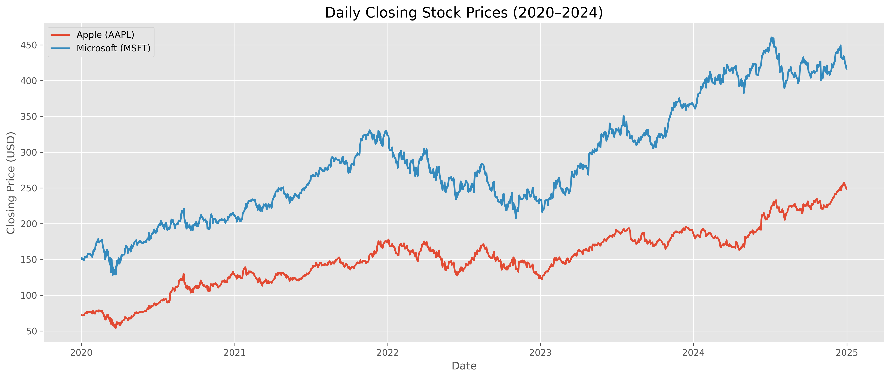
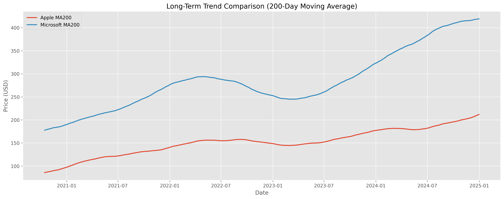
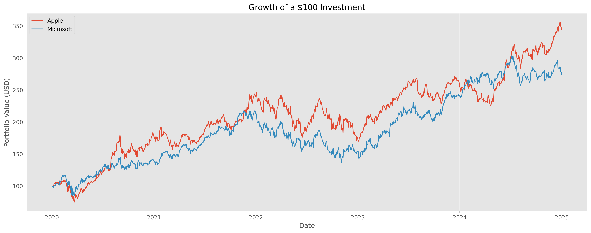
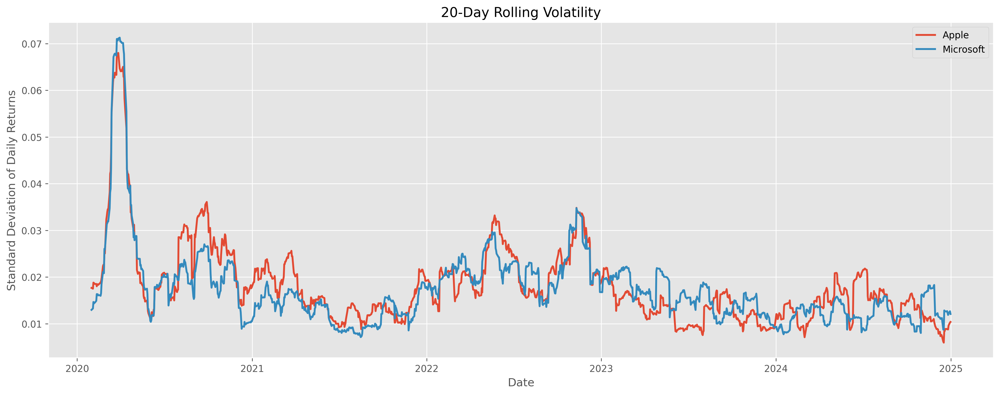

# Stock Price Time Series Analysis

A Python-based financial time series analysis project developed as part of the roadmap.sh Stock Price Time Series project.

This project analyzes the historical stock performance of Apple (AAPL) and Microsoft (MSFT) using historical market data obtained through the `yfinance` library.

---

## Features

- Download historical stock data using `yfinance`
- Visualize daily closing prices
- Weekly and monthly time series resampling
- 20-day and 200-day moving averages
- Trading volume comparison
- Daily return analysis
- Cumulative return analysis
- Rolling volatility analysis
- Correlation analysis
- Annual performance comparison

---

## Technologies Used

- Python
- Pandas
- Matplotlib
- yfinance
- Jupyter Notebook

---

## Project Structure

```text
stock-price-time-series/
│
├── Stock_Price_Time_Series.ipynb
├── README.md
├── requirements.txt
├── images/
```

---

## Sample Visualizations

### Closing Prices



### Moving Averages



### Cumulative Returns



### Volatility



